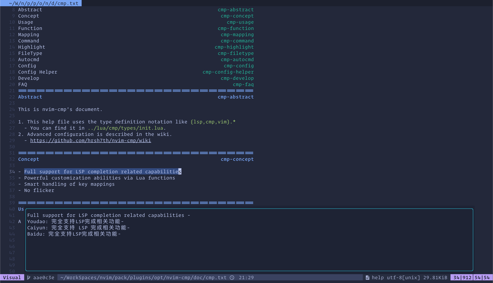

# Action

## plug

a git submodule wrap tools

### usage

- `plug add -u 'xxxx/xxxx' [-p] 'dir' [-b] branch_name` add a submodules, in
  neovim pack_path is specific `pack/plugins/opt/`
- `plug install` clone submodules
- `plug update` update submodules
- `plug remove -n xxx` remove submodules
- `plug list` show submodules

## translator

a terminal translator tool support caiyun baidu and youdao

### usage

set .env key I use it to combine neovim like that

